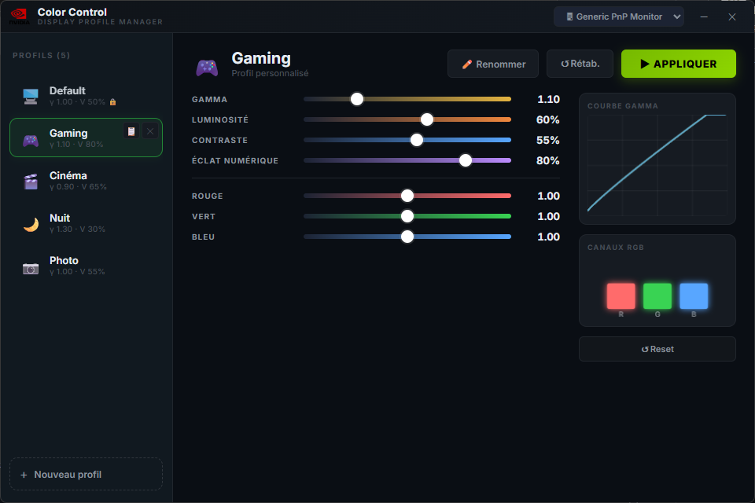

# 🖥️ Nvidia Color Control



A modern, fluid display profile manager for Windows, specifically designed for NVIDIA graphics card users. 

This application allows you to bypass NVIDIA Control Panel limitations by offering a fast, aesthetic interface and safety features for your color settings.

## ✨ Features

- **Profile Management**: Create, name, and customize multiple profiles (Gaming, Movie, Night, etc.).
- **Precise Control**: Adjust Gamma, Brightness, Contrast, and Digital Vibrance.
- **Digital Vibrance**: Perfect 1:1 mapping with NVIDIA settings (0-100%).
- **Soft Reset Button**: Side-by-side with Apply, it instantly restores factory defaults without losing your app slider positions.
- **Safety Confirmation**: A 7-second confirmation delay after applying changes to prevent black or unreadable screens.
- **Modern UI**: Dark glassmorphism design with smooth animations and Gamma curve visualization.

## 🚀 Installation & Usage

1. Download the `nvidia-color-control.exe` executable.
2. Launch the application (no installation required).
3. Select your display at the top.
4. Adjust sliders and click **APPLY**.
5. Confirm changes within 7 seconds to keep them.

> [!NOTE]
> Your profiles are automatically saved in `%APPDATA%\NvidiaColorControl\profiles.json`.  
> You can backup or move this file to keep your settings across different computers.

## 🛠️ Tech Stack

Built with:
- **Backend**: [Go](https://go.dev/) + [Wails v2](https://wails.io/).
- **Frontend**: HTML5 / Vanilla CSS / JavaScript (ES6+).
- **Low-level**: Custom integrations for Gamma and NVAPI control.

### Build Instructions

To compile the application yourself:
```bash
wails build
```

## ⚖️ License

This project is intended for personal use. Use at your own risk regarding your display hardware settings.
